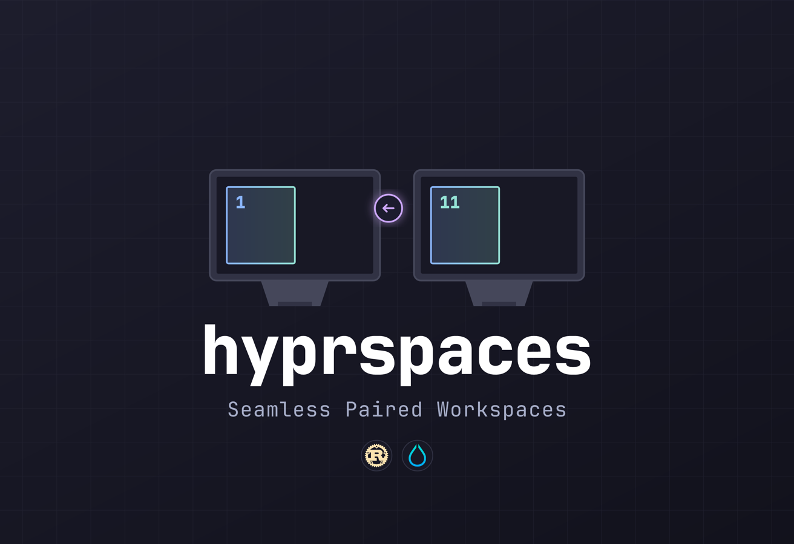

## Mission

hyprspaces aims to make paired workspaces feel effortless across multiple monitors, with a small Rust CLI that mirrors Hyprland's own workflows.

## Status

This repository is the legacy Rust CLI. The native Hyprland plugin is being developed at https://github.com/jtaw5649/hyprspaces.

## At a Glance

| Goal | What You Get | Why It Matters |
| --- | --- | --- |
| Keep primary and secondary monitors locked to the same workspace index | A CLI + daemon that rebalances workspaces on monitor changes and generates Hyprland fragments | Instant parity across displays and reliable recovery after hot-plug events |

## Requirements

- Hyprland with `hyprctl` available on PATH.
- A running Hyprland session for `daemon` and `waybar` (uses `HYPRLAND_INSTANCE_SIGNATURE`).

## Installation

### AUR (yay)

```bash
yay -S hyprspaces
```

### From source

Build the binary and make sure `hyprspaces` is on your PATH:

```bash
cargo build --release
```

## Commands

All commands accept `--ipc <hyprctl|native>`. `hyprctl` is the default; `native` uses the hyprland-rs backend (including daemon event listening) and requires building with `--features native-ipc`.

- `hyprspaces paired switch <N>`: Switch both monitors to paired workspace N.
- `hyprspaces paired cycle next|prev`: Cycle to the next/previous paired workspace.
- `hyprspaces paired move-window <N>`: Move the focused window to paired workspace N.
- `hyprspaces paired grab-rogue`: Move windows from the secondary range back to their paired primary workspaces.
- `hyprspaces session save [--path <path>]`: Capture a session snapshot (best-effort).
- `hyprspaces session restore [--path <path>] [--mode auto|same|cold]`: Restore window placement from a snapshot.
- `hyprspaces daemon`: Rebalance paired workspaces on monitor add/remove events.
- `hyprspaces setup install|uninstall|migrate-windows`: Manage generated Hyprland fragments.
- `hyprspaces waybar --enable-waybar [--theme-css <path>]`: Emit Waybar JSON output and update on socket2 events.
- `hyprspaces completions <bash|zsh|fish>`: Generate shell completion scripts.
- `hyprspaces status`: Show daemon state, config path, and active workspace pairing.

## Session Snapshots (Best-effort)

`hyprspaces` can save the current workspace layout and attempt to restore it later.

Default snapshot path: `~/.config/hyprspaces/sessions/latest.json`.

Restore modes:

- `auto`: Uses `same` when the snapshot signature matches the current Hyprland session; otherwise falls back to `cold`.
- `same`: Moves windows by address (fast, accurate within the same Hyprland session).
- `cold`: Matches windows by `app_id`, `class`, `initial_class`, and `title` (unique matches only).

`cold` restore is placement-only. It does not launch missing apps and unmatched windows are moved to their paired primary slot when possible.

## Configuration

hyprspaces reads `~/.config/hyprspaces/paired.json`:

```json
{
  "primary_monitor": "DP-1",
  "secondary_monitor": "DP-2",
  "workspace_count": 10,
  "wrap_cycling": true
}
```

`workspace_count` defines how many workspaces are reserved per monitor and sets the pairing offset. Workspace 3 on the primary pairs with workspace 13 on the secondary when the count is 10.

`paired_offset` is still accepted for legacy configs. If both keys are present, `workspace_count` takes precedence.

`wrap_cycling` controls whether paired cycling wraps at the ends. When false, cycling stops at 1 and the configured count.

## Default Keybinds

`setup install` generates Hyprland bindings and sources them via `# BEGIN hyprspaces` blocks:

| Shortcut | Action |
| --- | --- |
| `Super+1…0` | Focus paired workspace (1–N) on both monitors (default 10) |
| `Super+Shift+1…0` | Move focused window to paired workspace (1–N) (default 10) |
| `Super+Scroll Up` | Cycle to previous paired workspace |
| `Super+Scroll Down` | Cycle to next paired workspace |

Arrow key bindings are also regenerated to move windows instead of swapping.

## Waybar Integration (Manual)

hyprspaces never edits Waybar configs. To generate example files, run:

```bash
hyprspaces setup install --waybar
```

This writes `workspaces.json`, `workspaces.css`, and `theme.css` into `~/.config/hyprspaces/waybar/`. Copy those into your Waybar config, or add the module manually:

```json
"custom/workspaces": {
    "exec": "hyprspaces waybar --enable-waybar --theme-css ~/.config/hyprspaces/waybar/theme.css",
    "return-type": "json",
    "format": "{}",
    "on-scroll-up": "hyprspaces paired cycle prev",
    "on-scroll-down": "hyprspaces paired cycle next"
}
```

Edit `theme.css` to match your palette, or point `--theme-css` at your Waybar theme. If you omit the flag, hyprspaces reads `~/.config/waybar/style.css`.

## Uninstall

```bash
hyprspaces setup uninstall
```

The uninstall flow migrates windows back to the primary workspaces, removes the generated fragments, and reloads Hyprland.
It also stops the running hyprspaces daemon.
If Waybar example files were generated, it removes `~/.config/hyprspaces/waybar`.
